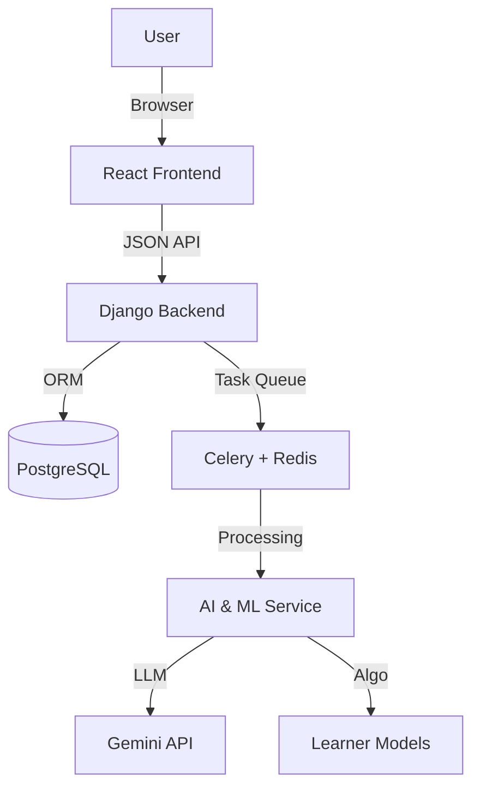

# Gyan AI Architecture & Implementation Plan

> **Objective**: Define a scalable, modern architecture for the Gyan AI Platform using **Django (Backend)** and **React (Frontend)**. This document serves as the master plan for the engineering team.

---

## 🏗️ High-Level Architecture

**Pattern**: Decoupled Client-Server (REST API)
- **Frontend**: React (Vite) Single Page Application (SPA).
- **Backend**: Django REST Framework (DRF) API.
- **Database**: PostgreSQL (Relational) + Vector Store (AI).

---

## 🛠️ Technology Stack

| Layer | Technology | Version | Usage |
| :--- | :--- | :--- | :--- |
| **Backend** | **Python / Django** | 5.0+ | Core API Logic, ORM, Admin, Auth. |
| **API** | **Django REST Framework** | 3.14+ | Serialization, ViewSets, Permissions. |
| **Frontend** | **React + Vite** | 18+ | Fast, component-based UI. |
| **Styling** | **Tailwind CSS** | 3.4+ | Utility-first styling for speed & consistency. |
| **Database** | **PostgreSQL** | 16+ | Primary data store with JSONB support. |
| **AI/ML** | **LangChain / Scikit** | Latest | AI Workflow management & Simple ML models. |

---

## ✅ Comprehensive Implementation Plan by Dashboard

### 🎓 1. Student Dashboard
**Goal**: "Personalized learning hub."

#### Tabs & Features
*   **Home/Overview**: Resume Learning Card, Daily Streak, XP Points, "Next Recommended Lesson".
*   **My Courses**: Active Courses (Progress %), Completed Courses (Certificates), Course Player (Video/Notes).
*   **Practice Zone**: Adaptive Quizzes, Mistake Review (Retry wrong answers), AI Oral Practice (Voice-to-Text).
*   **Performance**: Skill Graph (Radar Chart), Progress Timeline, Leaderboard (Class/Global).
*   **AI Tutor**: Study Plan View (Weekly Schedule), Chatbot Widget (Ask doubts).

### 👨‍🏫 2. Teacher Dashboard
**Goal**: "Classroom management & content creation."

#### Tabs & Features
*   **Overview**: KPI Cards (Attendance, Avg Score), Recent Submission Feed, Quick Actions.
*   **Class Manager**: Student Roster, Roster Upload (CSV), Attendance Sheet, Group Management.
*   **Curriculum Studio**: Course Builder (Drag & Drop Modules), Lesson Editor (Rich Text/Video), Quiz Creator.
*   **Grading**: Assignment Inbox, Split-screen Grading, Feedback Bank (Canned responses).
*   **Reports**: Class-level Analytics, "At-Risk" Student Alerts, Report Card Generator (PDF).

### 👪 3. Parent Dashboard
**Goal**: "Monitor child's progress without interference."

#### Tabs & Features
*   **Child Overview**: Summary Card for each child (if multiple), Current Course Active.
*   **Progress Report**: Weekly Attendance Log, Assignment Grades, Quiz Scores vs Class Average.
*   **Communication**: Message Teacher (Direct Chat), School Announcements.
*   **Settings**: Notification Preferences (SMS/Email alerts for absence), Subscription Management.

### �️ 4. Admin Dashboard
**Goal**: "Business operations & moderation."

#### Tabs & Features
*   **Ops Overview**: Platform Stats (Revenue, User Growth), Server Health Status.
*   **User Management**: Teacher/Student Directory, Verification Queue (Approve Signups), Role Management.
*   **Content Moderation**: Reported Content Log, Global tagging/categorization.
*   **Finance**: Subscription Plans (CRUD), Transaction History, Payroll (Teacher Payouts).
*   **Settings**: Global Site Config (Banner messages, Maintenance Mode).

### 👨‍💻 5. Developer Console (DevOps & Tech Team)
**Goal**: "System observability & technical control."

#### Tabs & Features
*   **API Telemetry**: Real-time request/response latency graphs, Error Rate (5xx/4xx) tracking.
*   **Logs Explorer**: Structured queryable logs (Access/Error) from Backend & AI Service.
*   **Feature Flags**: Toggle beta features (e.g., `ENABLE_GPT4_MODEL`, `NEW_UI_BETA`).
*   **Job Queue**: Celery Task Monitor (Pending/Failed AI Jobs) with "Retry" button.
*   **Database**: Schema migration history, connection pool status, backup-restore UI.

---

## 🤖 AI & Adaptive Learning Engine

### 🧠 1. Adaptive Learning Algorithm (Knowledge Tracing)
*   **Concept**: We don't just count "Correct Answers". We track **Skill Mastery**.
*   **Mechanism**:
    1.  Every Quiz Question is tagged with a Skill (e.g., "Algebra", "Tenses").
    2.  System maintains a **Probability of Mastery** ($P(L)$) for each skill per student.
    3.  **Bayesian Knowledge Tracing (BKT)** or simpler **Elo Rating** updates this score after every answer.
*   **Action**: If $P(L) < Threshold$, the system inserts **Remedial Modules** into the study plan. If $P(L)$ is high, it unlocks **Advanced Modules**.

### 🎯 2. Recommendation System
*   **Content-Based Filtering**:
    *   Input: Student's recent high-interest topics or weak areas.
    *   Output: Recommends courses with matching tags.
*   **Vector Similarity (RAG)**:
    *   We generate embeddings for all Course Descriptions.
    *   When a student asks "I want to learn about space", we search `CourseVectors` for nearest match.

### 🏋️ AI Training & Improvement
*   **Feedback Loop**: Every "Thumbs Up/Down" on an AI-generated explanation saves the prompt+response pair to a dataset.
*   **Fine-Tuning**: Periodically (Monthly), we use this dataset to fine-tune a small model (e.g., Llama 3) for cost efficiency, or adjust our Prompt Templates for Gemini.

---

## 🗄️ Database Design (Schema Snapshot)

### Core Models
*   **User**: `id`, `email`, `role` (Student/Teacher/Parent/Admin/Dev), `password_hash`.
*   **Profile**: `user_id` (FK), `avatar`, `phone`, `parent_id` (FK for Students).

### Academic Models
*   **Course**: `id`, `title`, `description`, `embedding_vector` (Array).
*   **Module**: `course_id` (FK), `order`, `title`.
*   **Lesson**: `module_id` (FK), `content_type` (Video/Text), `content_url`.
*   **Quiz**: `lesson_id` (FK), `max_score`, `passing_score`.

### Tracking Models
*   **Enrollment**: `student_id`, `course_id`, `status`, `completed_at`.
*   **SkillMastery**: `student_id`, `skill_tag`, `mastery_score` (Float 0-1).
*   **Submission**: `student_id`, `quiz_id`, `score`, `answers_json`.

### AI Models
*   **StudyPlan**: `student_id`, `generated_json`, `week_start_date`.
*   **AIInteraction**: `student_id`, `prompt`, `response`, `rating`.

---

## 👥 Team Assignment

| Team Member | Role | Focus Area |
| :--- | :--- | :--- |
| **Dev A** (Lead) | Backend | Arch Setup, Auth, Dev Console, AI Algorithms. |
| **Dev B** | Backend | LMS Models, Teacher/Admin Dashboards. |
| **Dev C** | Frontend | Student Dash, Parent Dash, Recommendation UI. |
| **Dev D** | Frontend | Teacher Dash, Admin Dash, Design System. |
| **QA** | Testing | E2E Testing of Adaptive Flows & Role Permissions. |
